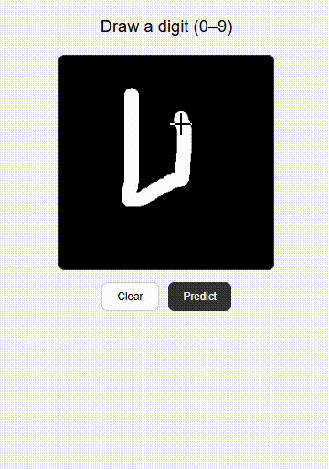

<div align="center">

# 🔢 MNIST Digit Recognizer

### Building a CNN from scratch to *truly* understand how it works


</div>

---

## 🎯 Purpose

This project isn't about chasing a leaderboard score — it's about **building a CNN from scratch** to genuinely understand the structure behind it: data preprocessing → architecture → training → evaluation → deployment. Every piece was built step-by-step, mentor-guided, using **TensorFlow** on the Kaggle Digit Recognizer dataset.

> 🧠 Learn by building, not by copy-pasting.

---

## 🎬 Demo

<div align="center">



*✍️ Draw a digit → 🤖 model predicts it live*

</div>

---

## 🗂️ Project structure

├── 📁 data/ # train.csv, test.csv (Kaggle dataset)
├── 📁 src/
│ ├── dataset.py # 🧹 Data loading & preprocessing
│ ├── model.py # 🏗️ CNN architecture
│ ├── train.py # 🏋️ Training script
│ ├── predict.py # 🔮 Generate predictions
│ └── evaluate.py # 📊 Accuracy, confusion matrix
├── 📁 app/
│ ├── app.py # 🌐 Flask server
│ ├── interface.py # ⚙️ Inference logic
│ └── templates/index.html # 🎨 Draw-a-digit UI
├── 📁 checkpoints/ # 💾 Saved model
├── 📁 results/ # 📈 Predictions & metrics
└── requirements.txt


---

## ⚡ Quick start

```bash
# 1️⃣ Setup environment
python -m venv .venv
.venv\Scripts\activate

# 2️⃣ Install dependencies
pip install -r requirements.txt

# 3️⃣ Train
python -m src.train

# 4️⃣ Predict
python -m src.predict

# 5️⃣ Evaluate
python -m src.evaluate

# 6️⃣ Launch the app 🚀
python app/app.py
```

🔗 Open **http://127.0.0.1:5000** → draw a digit → hit **Predict** ✨

---

## 🛠️ Tech stack

| Layer | Tools |
|---|---|
| 🧠 Modeling | TensorFlow / Keras |
| 📐 Data | NumPy, pandas |
| 📏 Evaluation | scikit-learn, matplotlib, seaborn |
| 🌐 Interface | Flask + HTML Canvas |

---

## 💡 Key learnings

- ⚠️ Preprocessing must match **exactly** between training and inference.
- 🚫 Kaggle's `test.csv` has no labels — needed a separate train/val split.
- 🖌️ Canvas digits (white-on-black) already match MNIST format — no inversion needed.

---

<div align="center">

Made with 🧠 + ☕ while learning deep learning, one layer at a time.

</div>

---

## 🤖 Built with AI assistance

This project was developed with mentorship-style guidance from **Claude (Anthropic)** — used for step-by-step learning, code review, and debugging throughout the pipeline.